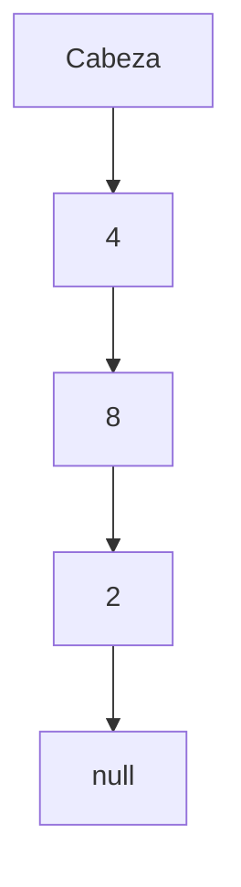

# Nodo simple y cadena

[Recurso anterior](../../unidad2/01-referencias-y-memoria/README.md) · [Índice de unidad](../README.md) · [Siguiente recurso](../../unidad2/03-crear-e-insertar/README.md)

## Objetivo

Representar una secuencia de nodos con terminación null.

## Conceptos y razonamiento

Un nodo simple contiene un dato y una referencia al siguiente. Una cadena finita acíclica termina en null. La cabeza identifica el primer nodo; una lista vacía tiene cabeza=null. Los datos pueden repetirse aunque los nodos sean objetos diferentes.

Recorrer requiere una referencia auxiliar que avanza por enlaces. No se debe mover la cabeza para inspeccionar y perder el inicio. El acceso a la posición i exige seguir enlaces; no existe acceso directo por índice como en un arreglo.

La representación debe conservar el invariante de terminación. Si el último nodo apunta a uno anterior, se introduce un ciclo y el recorrido que espera null no termina. Las listas circulares tienen otra regla y se estudian después. Los enlaces no se dibujan como una suma de direcciones: son relaciones entre objetos.

## Caso resuelto y prueba de escritorio

Se crean a=4, b=8, c=2; a.siguiente=b; b.siguiente=c; c.siguiente=null. El recorrido visita 4, 8, 2. La cabeza conserva a.



## Código completo

Archivo: [Main.java](Main.java).

```java
public class Main {
    static class Nodo {
        int dato; Nodo siguiente;
        Nodo(int dato) { this.dato = dato; }
    }
    public static void main(String[] args) {
        Nodo a = new Nodo(4), b = new Nodo(8), c = new Nodo(2);
        a.siguiente = b; b.siguiente = c;
        for (Nodo p = a; p != null; p = p.siguiente) System.out.println(p.dato);
        System.out.println("Cabeza: " + a.dato);
    }
}
```

## Ejecución paso a paso

1. Prepara el JDK según la [guía de ambiente](../../docs/ambiente-y-herramientas.md).
2. Abre una terminal en la carpeta de esta lección. Cada Main.java es independiente: no compiles todos juntos.
3. Ejecuta este comando en PowerShell (Windows), Terminal (Ubuntu) o Terminal (macOS):

```bash
java Main.java
```

4. Compara con [esperado.txt](esperado.txt). Antes de modificar, explica qué instrucción produce cada resultado.

### Salida esperada

```text
4
8
2
Cabeza: 4
```

## Recorrido guiado del código

Identifica datos de entrada, condición de salida y estado que cambia. Sigue el caso resuelto conservando los valores antes y después de cada cambio. Comprueba que el código implementa el contrato descrito y anota el paso que trata la entrada vacía, ausente o inválida cuando corresponda.

## Eficiencia y límites

Recorrer o contar Θ(n), memoria auxiliar Θ(1) si se itera.

## Errores frecuentes

- Mover cabeza en vez del auxiliar.
- Crear un ciclo cuando el contrato espera null.

## Ejercicio

Cuenta nodos sin modificar cabeza y prueba una lista vacía.

<details>
<summary>Solución y razonamiento (abre después de intentarlo)</summary>

Inicializa contador=0; recorre p=cabeza mientras p!=null, incrementa y avanza. Vacía produce 0. El contrato requiere cadena acíclica. Para detectar ciclos se necesita otra comprobación.

</details>

## Preguntas de comprensión

1. ¿Qué precondición o invariante necesita esta solución?
2. ¿Qué caso puede revelar un error aunque el ejemplo normal funcione?
3. ¿Qué costo aparece al localizar un dato antes de modificarlo?
4. ¿Qué tendría que cambiar si se modifica el contrato del ejercicio?

## Evidencia de aprendizaje

Entrega tu solución, una prueba de escritorio y casos normal, límite e inválido o ausente. Explica resultado esperado y obtenido. Incluye el análisis de tiempo y memoria indicando el modelo utilizado. Una salida correcta sin explicación no permite comprobar cómo llegaste a ella.

[Recurso anterior](../../unidad2/01-referencias-y-memoria/README.md) · [Índice de unidad](../README.md) · [Siguiente recurso](../../unidad2/03-crear-e-insertar/README.md)
