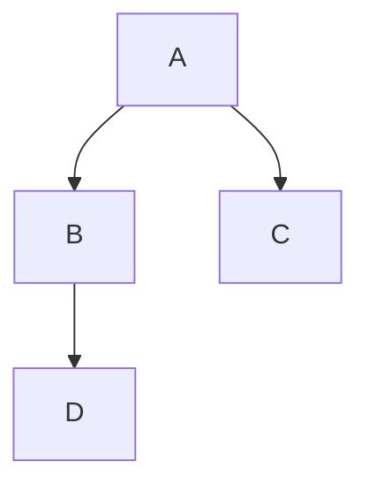

# Árboles: conceptos y representación general

[Recurso anterior](../../unidad3/03-torres-de-hanoi/README.md) · [Índice de unidad](../README.md) · [Siguiente recurso](../../unidad3/05-arbol-binario-de-busqueda/README.md)

## Objetivo

Distinguir raíz, hijo, hoja, profundidad y altura.

## Conceptos y razonamiento

Un árbol enraizado organiza nodos con una raíz y una relación padre-hijo sin ciclos. Excepto raíz, cada nodo tiene un padre dentro del árbol. Una hoja no tiene hijos. Profundidad cuenta aristas desde raíz; altura de un nodo es máximo número de aristas hasta una hoja. Bajo esta convención una hoja tiene altura 0.

Un árbol general admite una cantidad variable de hijos. Puede representarse con lista de hijos o primer hijo/hermano siguiente. Esta lección usa lista de hijos y requiere no compartir un nodo como hijo de varios padres ni introducir ciclos. La clase mínima no valida esas restricciones automáticamente; el constructor del ejemplo las cumple.

Contar nodos o recorrer visita raíz y luego hijos. La estructura es recursiva porque cada hijo puede ser raíz de un subárbol; no porque siempre debamos implementar sus recorridos con llamadas recursivas. Se puede usar una pila o cola explícita.

## Caso resuelto y prueba de escritorio

Raíz A con hijos B, C; B tiene hijo D. Hojas D, C; profundidad D=2; altura A=2. Preorden A, B, D, C. Cuatro nodos, pero tres aristas.



## Código completo

Archivo: [Main.java](Main.java).

```java
public class Main {
    static class Nodo {
        final String dato; final java.util.List<Nodo> hijos = new java.util.ArrayList<>();
        Nodo(String dato) { this.dato = dato; }
    }
    static int cantidad(Nodo n) {
        if (n == null) return 0;
        int total = 1;
        for (Nodo hijo : n.hijos) total += cantidad(hijo);
        return total;
    }
    static void preorden(Nodo n, java.util.List<String> salida) {
        if (n == null) return;
        salida.add(n.dato);
        for (Nodo hijo : n.hijos) preorden(hijo, salida);
    }
    public static void main(String[] args) {
        Nodo a = new Nodo("A"), b = new Nodo("B"), c = new Nodo("C");
        a.hijos.add(b); a.hijos.add(c); b.hijos.add(new Nodo("D"));
        java.util.List<String> salida = new java.util.ArrayList<>(); preorden(a,salida);
        System.out.println(salida); System.out.println(cantidad(a));
    }
}
```

## Ejecución paso a paso

1. Prepara el JDK según la [guía de ambiente](../../docs/ambiente-y-herramientas.md).
2. Abre una terminal en la carpeta de esta lección. Cada Main.java es independiente: no compiles todos juntos.
3. Ejecuta este comando en PowerShell (Windows), Terminal (Ubuntu) o Terminal (macOS):

```bash
java Main.java
```

4. Compara con [esperado.txt](esperado.txt). Antes de modificar, explica qué instrucción produce cada resultado.

### Salida esperada

```text
[A, B, D, C]
4
```

## Recorrido guiado del código

Identifica datos de entrada, condición de salida y estado que cambia. Sigue el caso resuelto conservando los valores antes y después de cada cambio. Comprueba que el código implementa el contrato descrito y anota el paso que trata la entrada vacía, ausente o inválida cuando corresponda.

## Eficiencia y límites

Recorrido Θ(n), pila O(h), salida Θ(n). Aquí h es altura; un árbol degenerado puede tener h=n-1.

## Errores frecuentes

- Confundir profundidad con altura.
- Permitir ciclos y usar un recorrido que supone árbol.

## Ejercicio

Implementa altura con convención hoja 0 y árbol vacío-1.

<details>
<summary>Solución y razonamiento (abre después de intentarlo)</summary>

Si null retorna-1. Inicializa máximo=-1 y toma max(altura(hijo)); retorna 1+máximo. Una hoja sin hijos retorna 0. Declara que el árbol es acíclico para que termine.

</details>

## Preguntas de comprensión

1. ¿Qué precondición o invariante necesita esta solución?
2. ¿Qué caso puede revelar un error aunque el ejemplo normal funcione?
3. ¿Qué costo aparece al localizar un dato antes de modificarlo?
4. ¿Qué tendría que cambiar si se modifica el contrato del ejercicio?

## Evidencia de aprendizaje

Entrega tu solución, una prueba de escritorio y casos normal, límite e inválido o ausente. Explica resultado esperado y obtenido. Incluye el análisis de tiempo y memoria indicando el modelo utilizado. Una salida correcta sin explicación no permite comprobar cómo llegaste a ella.

[Recurso anterior](../../unidad3/03-torres-de-hanoi/README.md) · [Índice de unidad](../README.md) · [Siguiente recurso](../../unidad3/05-arbol-binario-de-busqueda/README.md)
